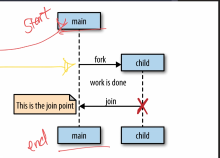

# Concurrency

## GO routines

```package main

import (
	"fmt"
	"time"
)

func someFunc(num string) {
	fmt.Println(num)
}
// fork join model
func main() {
	go someFunc("1")
	go someFunc("5")
	go someFunc("4")
	go someFunc("3") // async fork the fnction from the main
	// here it is not rejoinsing with main but if we use time.sleep it will rejoin with the main function
	// go is juts like async in golang these ae goroutines
	time.Sleep(time.Second * 2)
	fmt.Println("hey")
	
}
```
- Go routines are just like async function in js 
- Go keywork tells the function to fork it
- the go routines are independent of the function



## Channels

- By using channels we can tell the function to join the forked go routines
- Go routines are indepenedent of each other so what if one go routine want data from another go routine, Here we use Channels
- we can make one go rouitne to read from the channel and othetr to write into the channel
```package main
func main() {
	myChannel := make(chan int)
	go func() {
		add := 3 + 4*7 + 9
		myChannel <- add
	}()
	//  invoking now cuz its a annonymous function
	msg := <-myChannel

	fmt.Println(msg)
	fmt.Println("hey")
}
```
## Select

- In Go, the select statement is used to handle multiple channel operations simultaneously. It allows a goroutine to wait on multiple communication operations. Here’s a breakdown of what select does and how it relates to concurrency patterns:

    - Multiplexing Operations: select lets you wait on multiple communication operations (send or receive) simultaneously. This is useful when you have multiple channels and want to proceed as soon as any one of them is ready.

    - Non-Blocking Operations: If none of the channels are ready, a select statement with default case allows you to execute fallback logic or continue without blocking.
```
func main() {
	channel := make(chan int)
	anotherChannel := make(chan string)
	go func() {
		data := 445 + 67 + 43*76
		channel <- data
	}()
	go func() {
		data := "kflefe"
		anotherChannel <- data
	}()
	select {
	case msgFromChannel := <-channel:
		fmt.Println(msgFromChannel)
	case msgFromChannel := <-anotherChannel:
		fmt.Println(msgFromChannel)
	}

}
```
		
