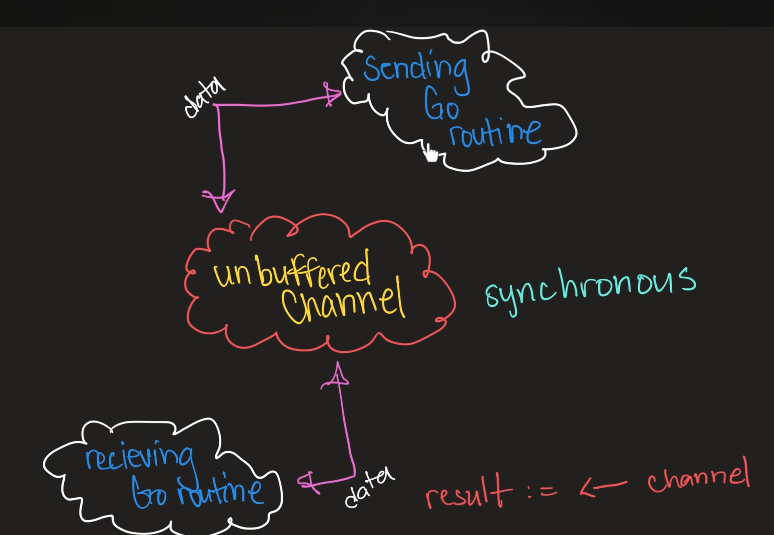
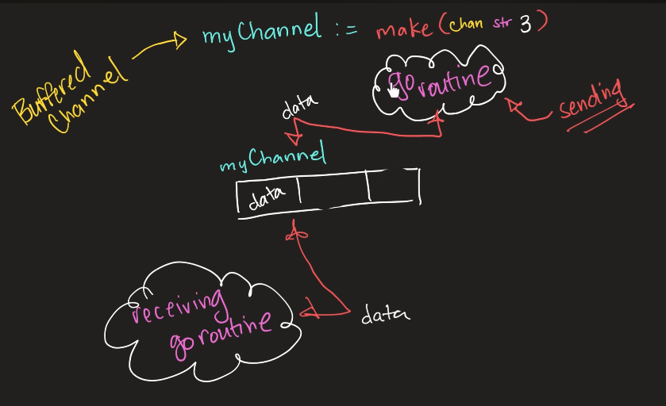
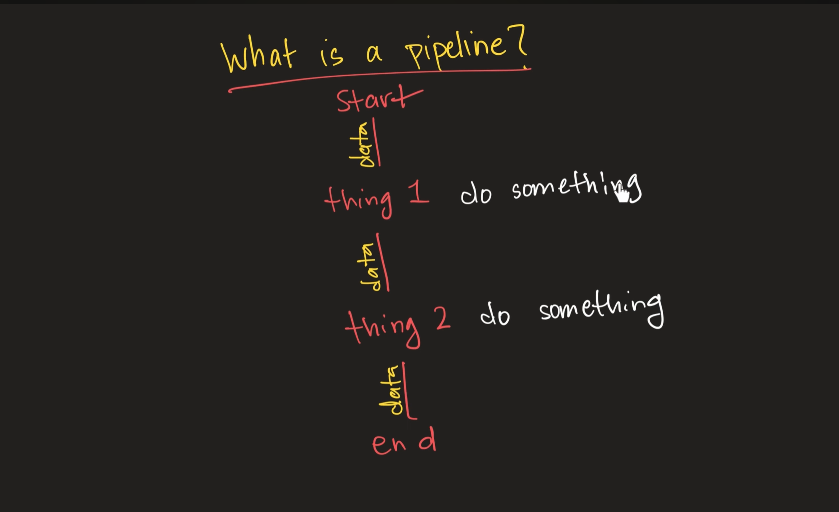

# Concurrency

## GO routines

```package main

import (
	"fmt"
	"time"
)

func someFunc(num string) {
	fmt.Println(num)
}
// fork join model
func main() {
	go someFunc("1")
	go someFunc("5")
	go someFunc("4")
	go someFunc("3") // async fork the fnction from the main
	// here it is not rejoinsing with main but if we use time.sleep it will rejoin with the main function
	// go is juts like async in golang these ae goroutines
	time.Sleep(time.Second * 2)
	fmt.Println("hey")
	
}
```
- Go routines are just like async function in js 
- Go keywork tells the function to fork it
- the go routines are independent of the function


## Channels

- By using channels we can tell the function to join the forked go routines
- Go routines are indepenedent of each other so what if one go routine want data from another go routine, Here we use Channels
- we can make one go rouitne to read from the channel and othetr to write into the channel
```package main
func main() {
	myChannel := make(chan int)
	go func() {
		add := 3 + 4*7 + 9
		myChannel <- add
	}()
	//  invoking now cuz its a annonymous function
	msg := <-myChannel

	fmt.Println(msg)
	fmt.Println("hey")
}
```
## Select

- In Go, the select statement is used to handle multiple channel operations simultaneously. It allows a goroutine to wait on multiple communication operations. Here’s a breakdown of what select does and how it relates to concurrency patterns:

    - Multiplexing Operations: select lets you wait on multiple communication operations (send or receive) simultaneously. This is useful when you have multiple channels and want to proceed as soon as any one of them is ready.

    - Non-Blocking Operations: If none of the channels are ready, a select statement with default case allows you to execute fallback logic or continue without blocking.
```
func main() {
	channel := make(chan int)
	anotherChannel := make(chan string)
	go func() {
		data := 445 + 67 + 43*76
		channel <- data
	}()
	go func() {
		data := "kflefe"
		anotherChannel <- data
	}()
	select {
	case msgFromChannel := <-channel:
		fmt.Println(msgFromChannel)
	case msgFromChannel := <-anotherChannel:
		fmt.Println(msgFromChannel)
	}

}
```
## For select loop

- Unbufferd channel: these channels are synchronous because the exchange of the message take place in instant
- Buffered channel: These channel are async we are using queue like utility where we can send our data and forget about it


- After sending  the data to the unbuffered channel the go routine will get blocked until the data will be received by the go routine

```
package main

func main() {
	// charChannel := make(chan string) // Unbuffered channel
	charChannel := make(chan string, 3) // buffered channel

}

```

- It is sending all the data to the queue and the sender isnt getting blocked at the same time
```package main

import "fmt"

func main() {
	// charChannel := make(chan string) // Unbuffered channel
	charChannel := make(chan string, 3) // buffered channel
	chars := []string{"a", "b", "c"}
	for _, s := range chars {
		select {
		case charChannel <- s:
		}
	}
	close(charChannel)
	for result := range charChannel {
		fmt.Println(result)
	}
}
```
## The done channel

## Pipeline

```
package main

import "fmt"

func sliceToChannel(nums []int) <-chan int {
	out := make(chan int)
	go func() {
		for _, n := range nums {
			out <- n
		}
		close(out)
	}()
	return out
}
func sq(in <-chan int) <-chan int {
	out := make(chan int)
	go func() {
		for n := range in {
			out <- n * n
		}
		close(out)
	}()
	return out
}
func main() {
	nums := []int{2, 3, 4, 5, 6}
	// stage 1
	dataChannel := sliceToChannel(nums)
	// stage 2
	finalChannel := sq(dataChannel)
	for n := range finalChannel {
		fmt.Println(n)
	}
}
```
